# 0615 · 核心技能

**四个技能，把内容工作的输入、行动和复盘连起来。**

从 X 链接中读懂外部信息，用个人助理安排今日行动；作品发布后，从评论、弹幕和双平台后台数据中收回反馈，为下一轮判断留下证据。

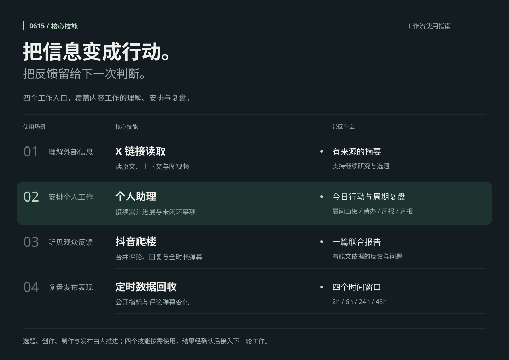

## 使用说明


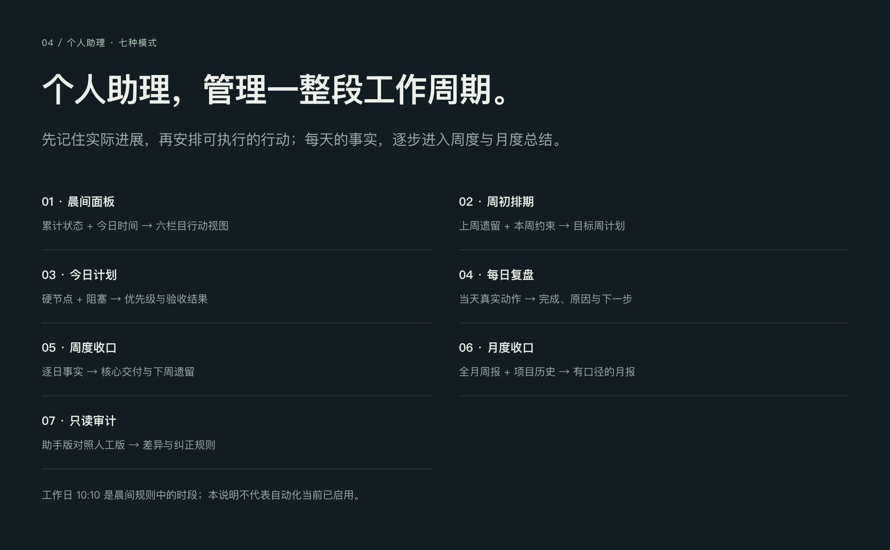

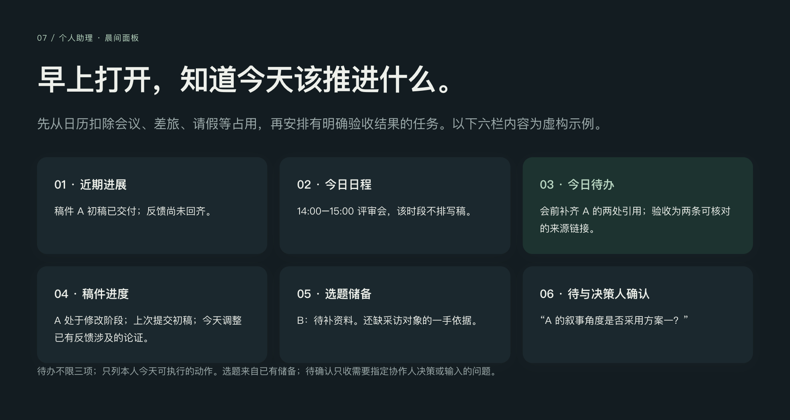

<details>
<summary>展开个人助理的证据、记忆、排期、复盘与验收说明</summary>

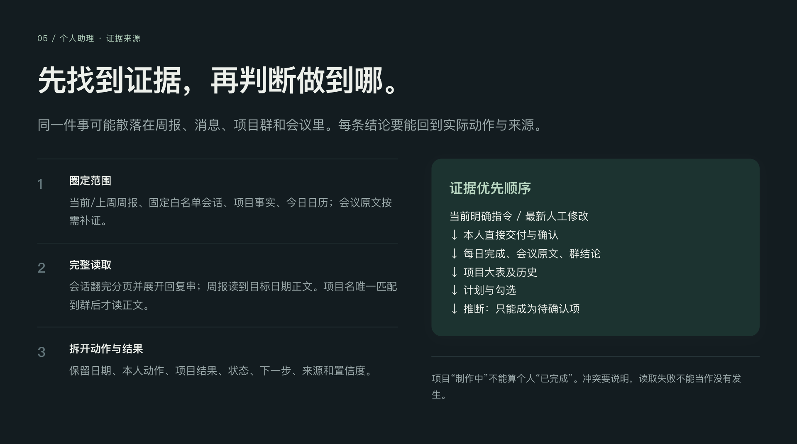

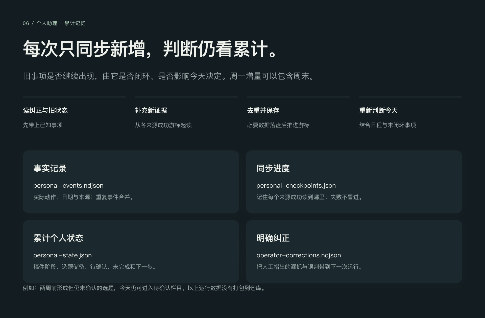

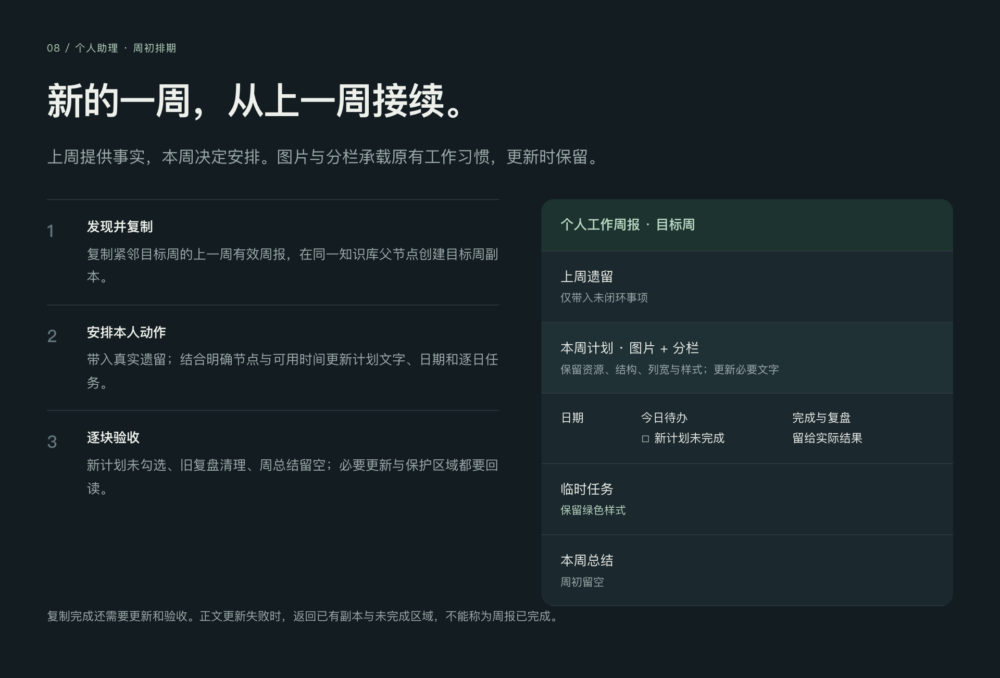

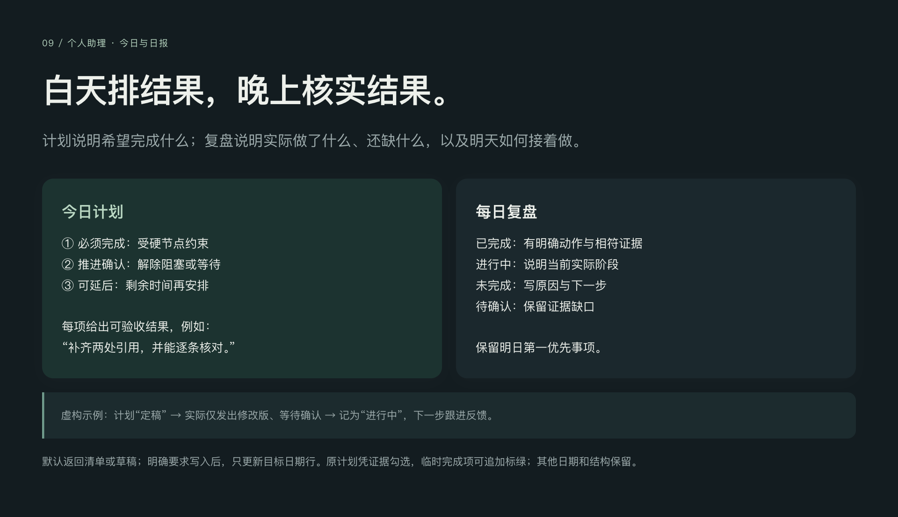

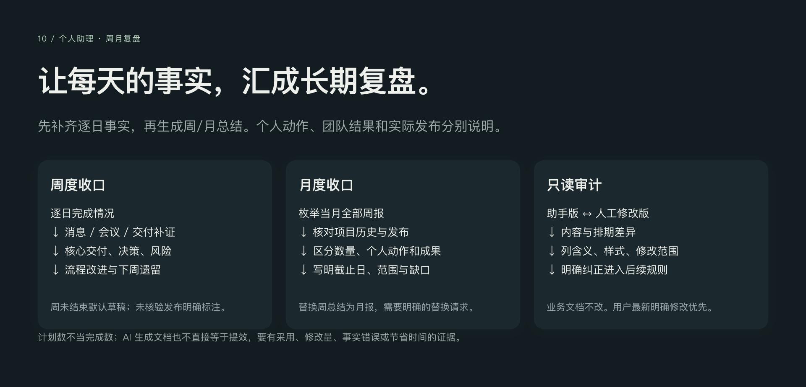

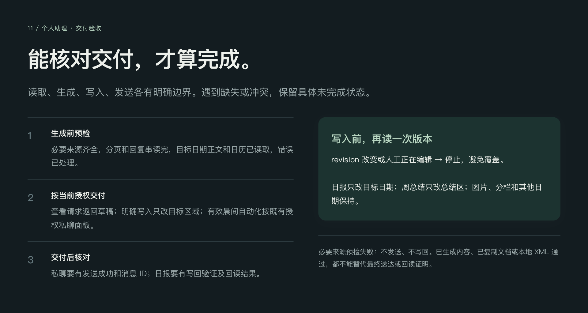

</details>

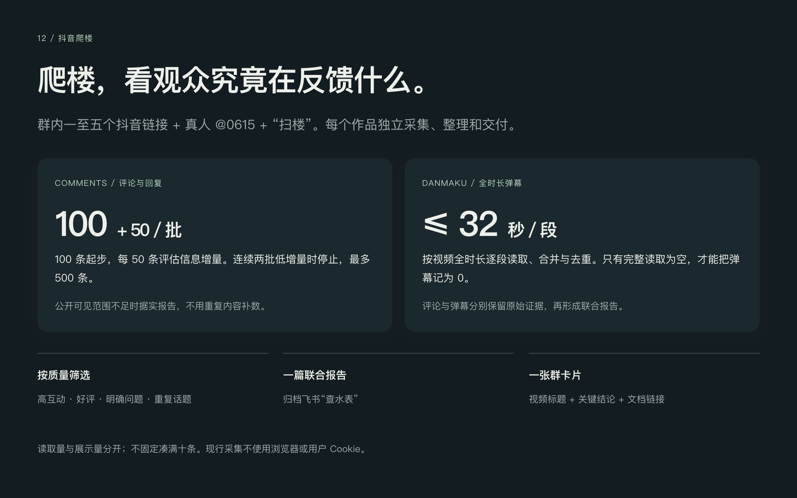

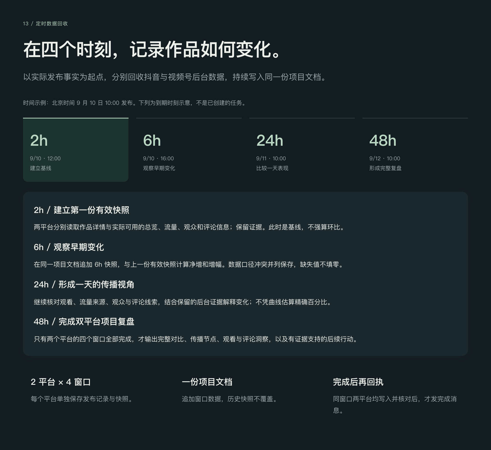

[查看全部 15 页图片说明](说明文档/工作流图解.md)

## 四个核心入口

| 技能 | 什么时候用 | 带回什么 |
|---|---|---|
| [X 链接读取](summarize-x-content/) | 理解、摘要或翻译公开 X 链接 | 原文上下文、图视频证据、有来源的摘要 |
| [个人助理](manage-personal-work-reports/) | 安排今天、本周，或整理已发生的工作 | 晨间面板、待办、排期、日报、周报、月报 |
| [抖音爬楼](douyin-comment-collector/) | 了解观众在评论和弹幕中反馈什么 | 联合报告与飞书卡片 |
| [定时数据回收](collect-content-performance-data/) | 视频实际发布后追踪表现 | 抖音与视频号的四窗口快照、项目复盘 |

## 怎样使用

**X 读取**：“这个 X 链接讲了什么？配图有哪些补充信息？”

**个人助理**：“结合今天日程和未完成事项，列出今日待办，并明确完成标准。”

**抖音爬楼**：在目标群发送“`<抖音作品链接>` @0615 扫楼”。

**数据回收**：“@0615 这期视频已发布：`<作品链接>`，按 2h、6h、24h、48h 回收数据。”

具体触发范围、身份、数量与完成条件以各目录中的 `SKILL.md` 为准。

## 单独安装

将所需目录整体复制到技能目录，或在仓库根目录运行：

```sh
python3 install.py summarize-x-content
```

默认复制到 `$CODEX_HOME/skills`，未设置时为 `~/.codex/skills`。可通过 `--destination /目标技能目录` 指定其他位置。已有同名目录时停止，不覆盖。

安装只复制文件，不会登录账号、发送消息、写入在线文档或启用自动化。

## 依赖与配置

这是现用工作流的个人私有备份，保留业务规则、飞书资源标识与本机路径。换电脑或账号前，阅读各目录 README 并适配本人配置。原文中的历史授权不自动授权其他用户或环境。

| 技能 | 外部依赖 |
|---|---|
| X 读取 | Python；视频抽帧需 ffmpeg；公开内容接口 |
| 抖音爬楼 | Node.js、Python；飞书交付需要相关 lark 技能与登录权限 |
| 数据回收 | 平台后台或 API、飞书文档能力、精确持久化调度与状态账本 |
| 个人助理 | 飞书消息/文档/日历等能力、项目事实读取技能与个人状态账本 |

底层技能、账号登录态与宿主调度服务没有捆绑在本仓库。会议整理、项目晨检是另外的工作流。

[会议整理 · 工作流说明 →](说明文档/会议整理.md)

## 打包与验证

打包日期：2026-09-10。脚本保持原字节；分发规则中的姓名与个人称呼改为通用表述；新增 README、流程图、十五页 HTML 说明、安装器及 SHA-256 清单。相同技能的重复安装副本已核对一致，仅保留一份。

已检查结构、源文件哈希、脚本语法、本地引用、独立安装及重复安装不覆盖；数据回收的 9 项现有测试通过。打包过程未执行真实爬楼、平台后台采集、飞书写入或定时任务。排除缓存、环境目录、登录凭据和运行数据。

## 第三方与呈现参考

抖音包中的 `third_party/MediaCrawler/douyin.js` 保留原 [LICENSE](douyin-comment-collector/third_party/MediaCrawler/LICENSE)，适用其非商业学习许可，未被重新授权。现行采集流程与历史辅助路线的边界以对应 `SKILL.md` 为准。

可视化说明借鉴 [frontend-slides](https://github.com/zarazhangrui/frontend-slides) 的单文件 HTML 演示与分屏叙事方式；内容和图形独立制作。
