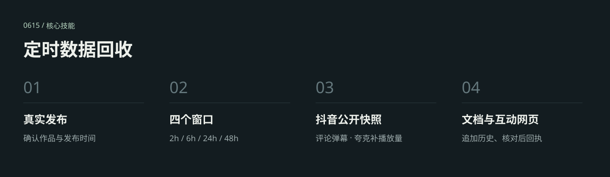

# 定时数据回收

入口：[SKILL.md](SKILL.md)。更新日期：2026-09-11。

## 当前流程

人类在群内明确 @0615，确认视频已经发布并提供唯一抖音链接后，以实际发布时间建立 2h、6h、24h、48h 四个单次任务。

- 匿名公开链路回收点赞、评论、分享、收藏，以及评论、回复和全时长弹幕变化。
- 仅播放量可通过用户电脑上已登录的夸克补采，保存采集时间与显示精度；页面约数不会记成精确值。夸克不可用时不阻断公开数据回收。
- 四个窗口更新同一份飞书文档、同一作品的妙搭互动网页，展示趋势、净增、窗口筛选及评论/弹幕变化。
- 保存原始证据，校验快照并回读文档和网页后发送阶段回执；48h 同时作为最终复盘回执。

当前仅支持抖音。公开采集不使用浏览器或用户 Cookie；夸克只读取播放量及作品匹配信息。其他后台专属指标保留为不可用，缺失值不填零。

## 安装与依赖

将本目录整体复制到 `~/.codex/skills/collect-content-performance-data`，或使用仓库根目录的安装脚本。已有同名目录时先比较并备份。

需要 Node.js 18+、Python 3.10+、`douyin-comment-collector`、飞书文档/妙搭/消息能力及相应授权，以及支持持久化单次任务的宿主。播放量补采另需现有夸克登录态。

安装只复制文件，不登录账号、不写在线文档、不发送消息、不启用定时任务。外部工具和登录态未捆绑在本目录中。

## 配置与验证

详细规则见 [数据来源](references/data-sources.md)、[输出契约](references/output-contracts.md) 和 [评论与弹幕变化](references/audience-change-contract.md)。`assets/content-performance-state.json` 是空账本模板。本机路径在其他环境使用前应适配，外部动作以当前会话授权为准。

脚本按本地现用版本同步，排除旧备份、缓存、凭据与运行数据。现有快照测试和脚本语法检查通过；上传过程未触发实际采集或定时任务。
