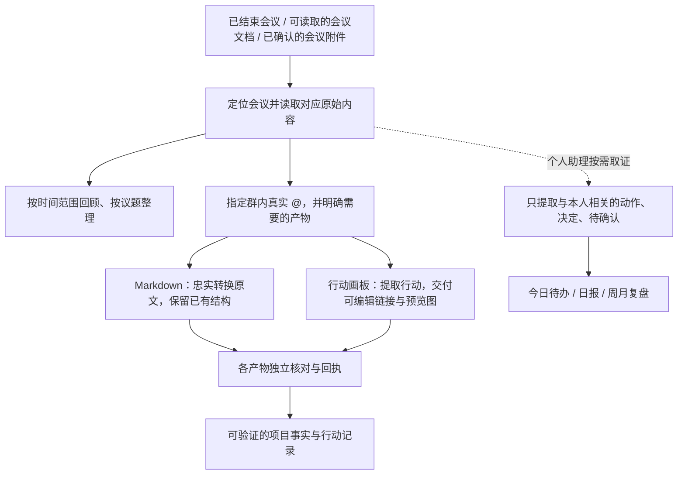

# 会议整理在哪里

会议整理是四个核心包之外的独立工作流。本仓库目前包含它的关系说明，**尚未打包会议技能本体**；个人助理只按需读取相关会议证据，用于判断本人行动和复盘。

## 三层能力各自负责什么

| 层次 | 本机技能 | 作用 |
|---|---|---|
| 按时间整理会议 | `lark-workflow-meeting-summary` | 根据今天、本周或指定时段定位会议，汇总纪要与逐字记录入口；需要内容总结时按底层规则读取原始记录 |
| 会后指定产物交付 | `process-content-meeting-mention` | 在规定群内，人类真实 @0615 且明确产物后，分别交付会议 Markdown、行动画板，或两个独立任务 |
| 读取飞书会议资料 | `lark-vc`、`lark-note`、`lark-minutes`、`lark-doc` | 搜索已结束会议、定位纪要、读取逐字记录、妙记与文档 |

会后交付还按产物依赖 `lark-markdown`、`lark-im`、`beautiful-feishu-whiteboard`，并借助 `content-ops-agent` 的项目事实与行动记录规则。底层提供访问能力，上层决定整理口径与交付方式。本机规则已含按会议类型整理的业务约定，不能把整套流程等同于未经定制的通用飞书能力。

## 从会议到工作行动

两项产物共享会议来源，各自执行与验收；一项失败不能算全部完成。个人助理不会因为读过会议记录，就自动生成会后文件或向群里发消息。

## 不同会议怎样整理

| 会议类型 | 重点 |
|---|---|
| 分镜会 / 拉片 | 按段落或镜头列具体修改意见、怎么改及必要原因；独立要求完整保留 |
| 选题会 | 区分“推进”和“延后推进”，记录已明确安排；未定或否决不冒充延后推进 |
| 分享会 / 周会 / 月会 | 整理实际形成的结论、决策和后续行动；未拍板内容保留待确认 |
| 混合会议 | 按议题内容判断，不只凭会议标题套模板 |

负责人、截止时间和原因只采用原文明确内容，不补猜。要求重新总结时，依会议读取规则从原始对话或妙记文字记录分析；要求原文转 Markdown 时保留原文，不能借分类整理删改全文。

## 触发和使用示例

- “整理这周的会议纪要”：走时间范围汇总。
- 规定群内“@0615 这场会议转成 MD”：只交付 Markdown。
- 规定群内“@0615 这场会议要行动画板”：交付可编辑画板链接和群内预览图。
- “结合会议里我负责的事项，列出今日待办”：个人助理按需取证，再结合日程排序。

会后产物入口有规定群、真实提及、会议上下文和明确产物的条件；仅说“处理一下会议”时，现有规则会先确认产物。安装与本机规则不代表监听或定时任务当前已运行，运行状态需另行核对。

返回：[四个核心技能](../README.md) · [个人助理完整说明](../manage-personal-work-reports/README.md)
