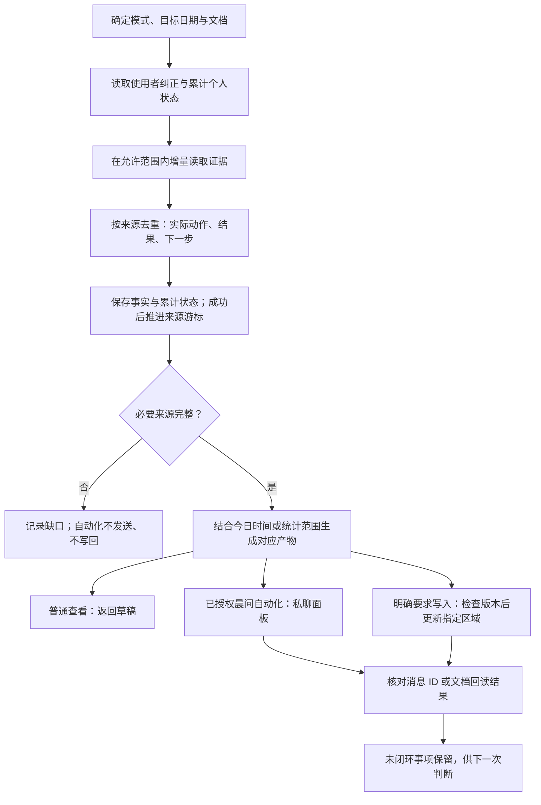

# 个人工作助理：从累计事实到每日行动

它把周报、允许读取的消息、稿件与选题状态、项目事实和日程合成一个持续更新的个人工作系统。既帮助安排今天，也把实际发生的工作接到日报、周总结和月报中。

[打开交互式工作流说明](../docs/workflow-guide.html#assistant) · [执行规则](SKILL.md)

## 一次运行怎样完成

增量读取决定“这次需要补哪些证据”；累计状态决定“今天还要记住哪些事”。两周前未解决的稿件或确认事项仍可进入今天的面板。周一同步可以覆盖周末，正文只保留影响当前安排的变化。

## 七种模式：从什么时候用到最终交付

| 模式 | 示例请求 / 时机 | 主要依据 | 交付与写入范围 |
|---|---|---|---|
| 晨间个人面板 | 已配置的工作日 10:10（北京时间） | 累计状态、新增消息、周报、稿件/选题、当日日程 | 六栏目面板；既有授权范围是私聊发送和本地状态更新，不自动改周报 |
| 周初排期 | “根据上周情况，生成本周周报” | 上周实际完成与遗留、明确节点、本周时间约束 | 复制紧邻上一周的有效周报，在同一知识库父节点安排目标周 |
| 今日计划 | “结合今天日程列出待办” | 当日计划、硬节点、阻塞和可用时间 | 必须完成 / 推进确认 / 可延后，每项有验收结果；默认返回清单 |
| 每日复盘 | “总结今天工作”；“写进今天这一行” | 当天本人动作、交付、消息、原计划，必要时会议原文 | 已完成 / 进行中 / 未完成及原因 / 下一步；明确授权写入后只更新目标日期行 |
| 周度收口 | “写本周总结” | 每日实际完成，辅以消息、会议、交付物和项目历史 | 核心交付、决策、风险、流程改进、下周遗留；写入时只改总结区 |
| 月度收口 | “整理这个月的月报” | 当月全部周报的逐日事实、项目历史、可核验发布 | 项目数量、实际发布、本人管理动作、AI/流程成果、未闭环项；注明截止日与缺口 |
| 只读审计 | “和我修改的版本对一遍” | 助手版与使用者最新修改版 | 内容、排期、列含义、样式与修改范围差异；业务文档不改，明确纠正纳入后续规则 |

表中的时段是技能规则，安装文件不会启用定时任务。本说明没有核验宿主当前哪些自动化正在运行。日报与周/月总结的定时执行也需要单独有效配置与授权。

## 它读取哪些信息

| 来源 | 用来判断什么 | 读取边界 |
|---|---|---|
| 当前周报与上周周报 | 原计划、实际完成、遗留和最新人工修改 | 读取目标日期正文；只看标题、目录或搜索命中不算完成 |
| 已配置的白名单会话 | 本人的交付、确认、反馈和阻塞 | 同一时间窗翻完分页，并展开返回的回复串；不以全局搜索扩大范围 |
| 相关项目群 | 补足活跃项目上下文 | 先由项目大表得到项目名，再唯一匹配群；没有匹配或多义匹配时记录缺口 |
| 项目大表与变更历史 | 当前节点、排期变化和项目结果 | 表中计划不能直接认定为个人任务或完成事实 |
| 飞书日历 | 会议、差旅、请假与可用时间 | 用用户身份读取；先扣除不可用时段，再排今日任务 |
| 相关会议原始记录 | 补证决策、明确行动和责任 | 按当前任务需要读取；会议独立交付由另一个工作流负责 |
| 累计状态与明确纠正 | 保留旧的未闭环事项，修正漏抓与误判 | 每次运行先读取，避免只依赖当前聊天记忆 |

资源定位与会话白名单见 [feishu-scope.md](references/feishu-scope.md)。默认不下载二进制附件、不访问无必要的外部链接。

## 会议整理与个人助理的关系

会议整理有独立入口：`lark-workflow-meeting-summary` 负责按时段汇总会议，`process-content-meeting-mention` 负责指定群内 @ 后的 Markdown 或行动画板交付。它们借助 `lark-vc`、`lark-note`、`lark-minutes` 等读取资料；本机还包含按会议类型整理的业务规则。

个人助理按需从会议原文中核实与本人有关的动作、决定和待确认事项，再接到今日待办、日报或周月复盘中。它不承担整场会议的独立产物交付。**本仓库的四个包未包含会议技能本体。**

[会议工作流、不同会议的整理口径与触发示例 →](../docs/meeting-workflow.md)

## 它为什么能接续昨天

| 本地记录 | 保存的内容 | 更新规则 |
|---|---|---|
| `personal-events.ndjson` | 有日期、来源的实际动作与结果 | 按来源 ID 去重落盘，跨群重复事件合并 |
| `personal-checkpoints.json` | 每个来源已成功同步到哪里 | 必要数据成功保存后才推进，读取失败不能冒充成功 |
| `personal-state.json` | 稿件阶段、选题储备、待确认、未完成、下一步与来源键 | 新证据更新判断；旧的未闭环事项持续保留 |
| `operator-corrections.ndjson` | 使用者明确纠正的遗漏和误判 | 每次运行先读，作为后续判断约束 |

这些记录与项目账本放在同一目录但分文件存储。仓库只包含规则和脚本，不包含这些实际运行记录。

每项事实保留：`日期｜项目/主题｜本人动作｜项目结果｜状态｜下一步｜证据｜置信度`。状态限定为已完成、进行中、未完成、待确认。

判断优先顺序是：当前明确指令与最新人工修改 → 本人直接发言/交付/确认 → 周报实际完成、会议原文和群结论 → 项目大表与历史 → 计划与勾选 → 推断。更晚、更直接的证据优先；存在冲突要说明。推断只能产生待确认项。

## 晨间面板：六个栏目各自解决什么

下表是**虚构示例**，用于说明产物结构，不是实际工作记录。

| 栏目（固定顺序） | 应包含的判断 | 示例 |
|---|---|---|
| 近期进展 | 已发生且影响今天的本人动作或项目变化 | 稿件 A 初稿已交付，反馈尚未回齐 |
| 今日日程 | 已读取确认的会议与不可用时段 | 14:00–15:00 评审会，该时段不排写稿 |
| 今日待办 | 按硬节点与可用时间排序，有明确验收结果 | 会前补齐 A 的两处引用，验收为两条可核对来源链接 |
| 稿件进度 | 稿件名、阶段、上次实际动作、今天下一步 | A：修改阶段；昨晚提交初稿；今天根据已到反馈调整论证 |
| 选题储备 | 已有题目或明确方向，标记可开写/待补资料/待确认 | B：待补资料，仍缺采访对象的一手依据 |
| 待与决策人确认 | 需要指定协作人拍板、确认口径或提供输入的一句话 | “A 的叙事角度是否采用方案一？” |

今日待办不固定限制三项，但要今天可执行、与本人有关、有清楚结果。制作项目只有需要本人确认、审核或决策时才进入个人任务。原始规则中的指定协作人由环境配置确定。

已完整读取且没有内容才可写“暂无”；读取失败不能写成暂无。必要来源不完整时，自动化预检阻止发送或写回，并报告缺口。

## 周初排期：接续事实，同时保留周报结构

1. 确定目标周；读取上周证据和本周日程，区分“上周取证”和“本周排期”。
2. 发现紧邻目标周的上一周有效周报，复制到同一知识库父节点。不能用空白文档或过时固定模板替代。
3. 只带入上周未完成、或明确继续的事项。项目节点转换为本人需要交付、审核、确认的具体动作。
4. 更新标题、日期、遗留待办、分栏内的计划文字和逐日安排；新计划全部未勾选，清理旧复盘，周总结保持空白。
5. 保留图片及其资源标识、分栏结构、列宽、链接与样式，保留绿色“临时任务”。右栏用于实际完成与复盘，不重复计划优先级。
6. 逐块回读，核对必要更新和受保护结构。复制成功但正文更新失败时返回现有副本与未完成区域，不能把副本链接当作完成证明，也不创建第二份。

| 周报区域 | 周初状态 | 日常更新 |
|---|---|---|
| 上周遗留 | 只保留确需接续的事情 | 用后续实际动作核对闭环 |
| 本周计划与图片分栏 | 更新必要文字，保留图片与结构 | 不因补日报重建整个区域 |
| 日期 / 今日待办 | 目标周日期；新计划未勾选 | 仅凭相符证据勾选 |
| 实际完成 / 复盘 | 清空旧结果或保留已有脚手架 | 记录本人动作、结果、未完成原因与下一步 |
| 本周总结 | 周初留空 | 周末或明确要求时，汇总已核实事实 |

目标周已有文档时应使用现有目标，避免重复创建；具体修改先验证目标与版本。姓名在本包中已替换为通用称呼，迁移配置时应核对实际周报标题匹配规则。

## 今日、每周、每月怎样连起来

**今日计划**先给可执行清单，例如“补齐两处引用并能逐条核对”，而不是“继续推进”。日程参加本身不自动算工作成果。

**每日复盘**用当天证据核实动作。例如计划写“定稿”，实际只发送修改版、尚待确认，应记“进行中：修改版已发；等待确认；下一步跟进反馈”。有真实交付但未勾选的任务可据证更新；已勾选但没有相符证据也不能自动当成正式完成。

**周度收口**先读每一天的完成情况，再总结交付、关键决策、卡点、流程改进和下周遗留。周尚未结束默认先出草稿，除非明确要求提前写入。未核验发布的事项标记“待发布核验”。

**月度收口**枚举当月周报，明确统计范围和截止日，再核对个人动作与实际发布。涉及把“本周总结”替换成“月报总结”时，只有明确请求替换才改标题与正文。AI 生成了文档不能直接认定提效，需要采用情况、人工修改量、事实错误或时间证据。

**只读审计**比较助手版与人工修改版：有没有把计划当成果、排满差旅日、误解右栏、改坏样式或越过目标区域。输出差异，将明确纠正接入后续判断，不把审计变成业务文档修改。

## 哪些请求会写入

| 请求 / 上下文 | 执行边界 |
|---|---|
| “看看”“列出”“总结一下” | 默认返回清单或草稿 |
| “写进 / 填入 / 更新这个链接” | 在目标与日期明确时更新对应区域，写前核对 revision，写后回读 |
| 已有效配置和授权的 10:10 晨间运行 | 读取证据、更新本地状态、向使用者私聊面板；不自动改周报 |
| 另行修改日程、飞书任务、项目大表或发送其他消息 | 需要对应动作的明确授权，周报写入授权不包含这些动作 |

写入前再次读取版本；遇到 revision 改变或使用者正在编辑就停止，避免覆盖现场修改。日报只改目标日期行，周总结只改总结区。安装本包不恢复历史暂停任务，也不创建新自动化。

## 什么才算“完成”

**预检**核对必要来源、分页结束、回复串展开、目标日期正文、日历读取、错误处理和纠正记录。校验失败时，自动化不发送、不写回。

**交付后核对**使用同一运行回执：晨间面板必须有发送成功状态与消息 ID；日报必须有写回验证和回读结果。发送失败、版本冲突、未回读都应报告未完成。

本地 XML 校验检查结构；实际飞书回读确认在线结果，两者不能互相替代。相关脚本与详细字段：

- [运行回执与两阶段检查](references/execution-gates.md)
- [周报结构与 XML 校验](references/report-xml.md)
- [工作流完整契约](references/workflow-contract.md)

## 安装、依赖和迁移

将本目录整体复制到技能目录，或使用仓库根目录的安装器。已有同名目录时先比较、备份；安装器不会覆盖。安装只复制文件，不登录账号、不写在线文档、不发送消息、不启用自动化。

需要 Python 3.10+；`lark-shared`、`lark-im`、`lark-wiki`、`lark-doc`、`read-content-project-board`、`read-content-progress-reports`、`lark-calendar`；会议证据使用 `lark-minutes` 或 `lark-vc`；明确需要飞书任务时另需 `lark-task`。外部技能、账号权限与调度服务未捆绑。

姓名及个人称呼已在分发文件中改为通用文字；资源 ID、白名单、路径等仍是现有环境配置，仓库保持私有。迁移前核对身份、周报标题规则、资源范围、状态目录和有效授权；源文中的历史授权不自动授权其他环境。包内不含 Cookie、认证令牌、浏览器资料、历史消息、运行账本或采集结果。
