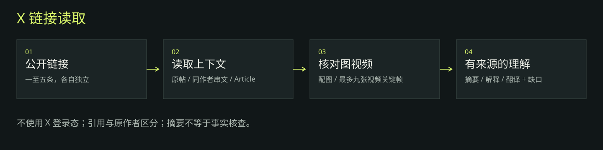

# X 链接读取

入口：[SKILL.md](SKILL.md)。这是现用技能的个人私有备份；脚本与业务流程保留；分发文字中的姓名和个人称呼改为通用表述，打包新增本说明与工作流程图。

## 安装

将本目录整体复制到目标环境的技能目录（如 `~/.codex/skills/summarize-x-content`），保持目录结构。已有同名技能时先比较、备份再决定是否替换。仓库根目录也提供不会覆盖现有目录的安装脚本。

安装只复制文件，不登录账号、不修改在线文档、不发送消息、不启用自动化。

## 依赖

Python 3.10+；视频抽帧需要 ffmpeg，可通过 FFMPEG_BINARY 或 PATH 指定。

这些外部技能、工具、平台登录态和调度服务没有捆绑在本目录中，需在目标环境单独准备。

## 配置与使用边界

使用公开 FxTwitter 接口，不需要 X Cookie 或 API Key。网络接口变化可能影响读取。脚本保留原机 ffmpeg 兜底路径，其他机器请设置 FFMPEG_BINARY。

包含个人规则和资源定位信息，仓库保持私有。没有打包 Cookie、认证令牌、浏览器资料、历史群消息、采集结果或运行账本。脚本中的固定本机路径保留原值；在不同目录或电脑使用时，应改为目标环境实际位置。执行任何外部动作前，以目标会话中的真实用户授权为准。
