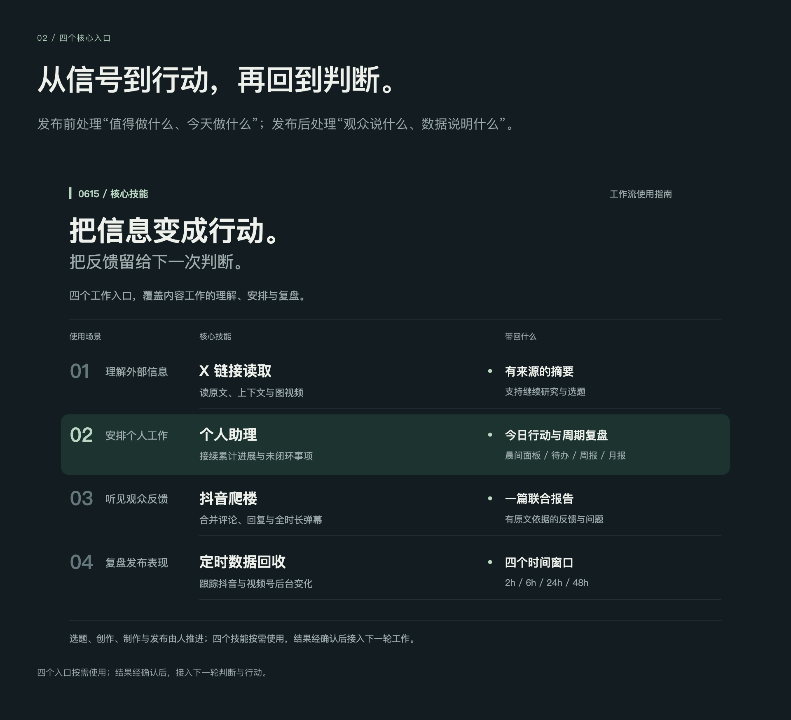
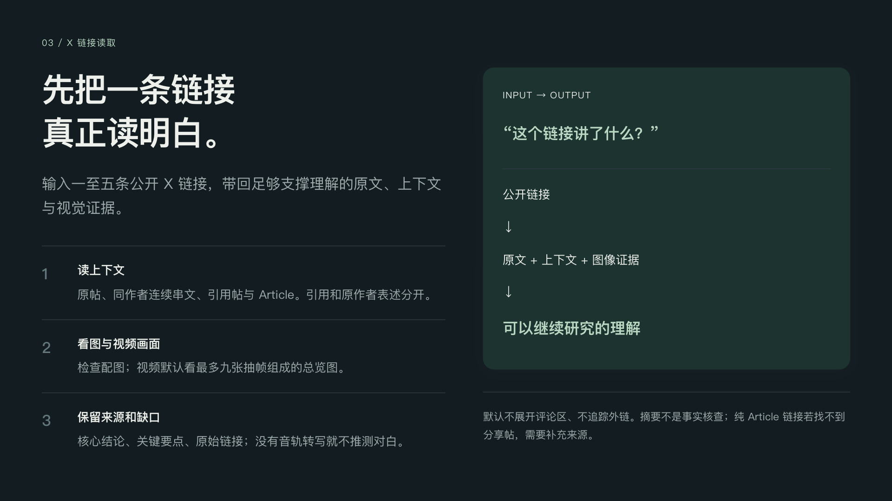

# 工作流图解

直接浏览以下图片即可阅读全部说明。

## 工作流总览

## 四个核心入口

## X 链接读取

## 个人助理 · 七种模式

## 个人助理 · 证据来源

## 个人助理 · 累计记忆

## 个人助理 · 晨间面板

## 个人助理 · 周初排期

## 个人助理 · 今日与日报

## 个人助理 · 周月复盘

## 个人助理 · 交付验收

## 抖音爬楼

## 定时数据回收

## 支撑能力

## 使用示例

